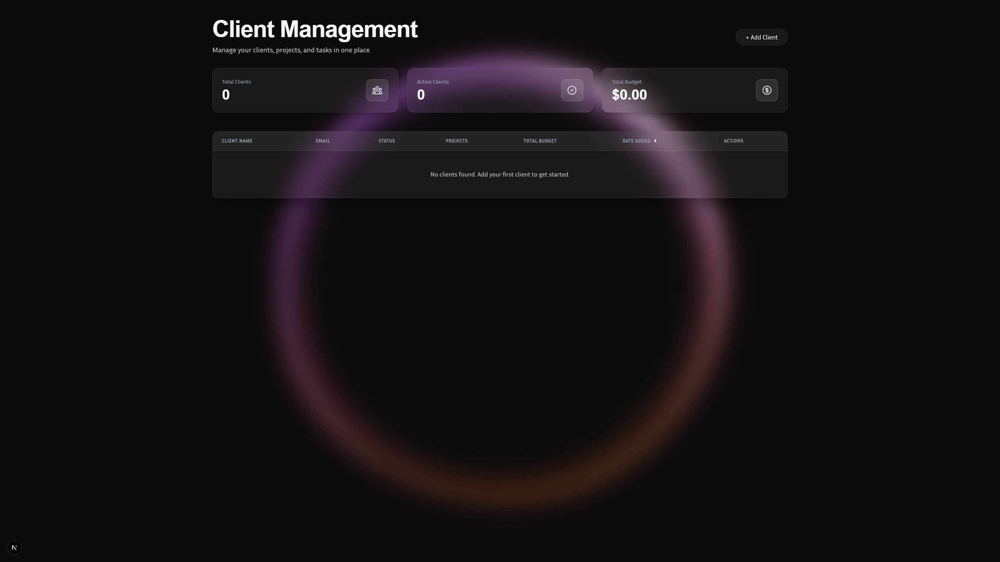
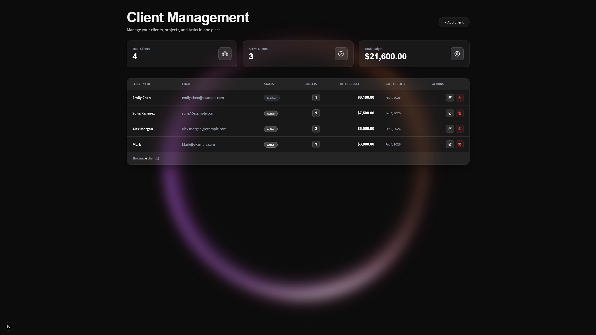
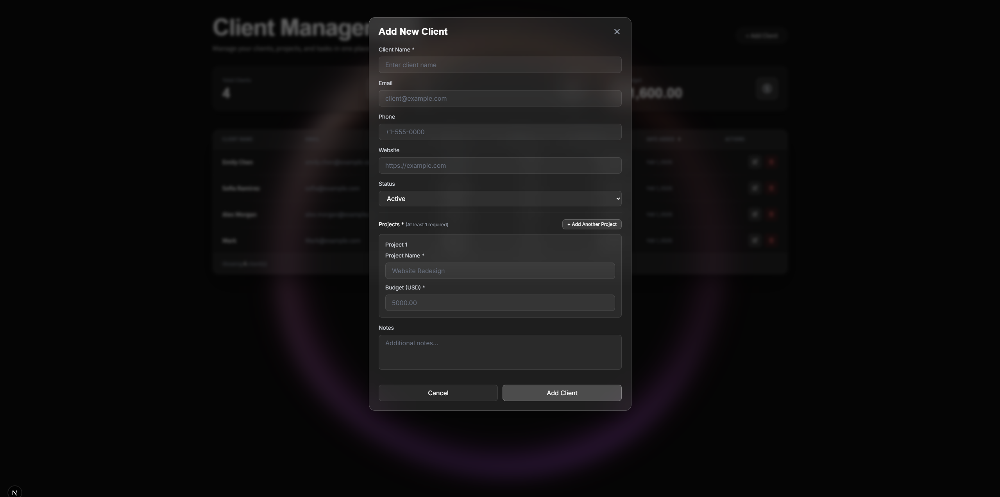

# Client Management System

A modern, beautiful client management system built with Next.js 16, React 19, and Supabase. Manage your clients, projects, and tasks efficiently with a stunning dark-themed interface featuring aurora backgrounds and animated orb effects.



## Features

- **Client Management** - Add, edit, and track all your clients in one place
- **Project Tracking** - Organize projects by client with budget tracking
- **Task Management** - Create and manage tasks within projects with priority levels
- **Real-time Statistics** - View total clients, active clients, and total budget at a glance
- **Beautiful UI** - Dark theme with aurora background effects and glassmorphic cards
- **Responsive Design** - Works seamlessly on desktop and mobile devices
- **Type-Safe** - Built with TypeScript for maximum reliability



## Tech Stack

- **Framework**: [Next.js 16](https://nextjs.org) (App Router)
- **Language**: TypeScript
- **Styling**: Tailwind CSS 4
- **Database**: [Supabase](https://supabase.com) (PostgreSQL)
- **UI Components**: Custom components with TanStack Table
- **Animation**: OGL for WebGL effects
- **Fonts**: Clash Display, Inria Sans, Playfair Display



## Prerequisites

Before you begin, make sure you have:

- Node.js 18+ installed
- A Supabase account ([sign up here](https://supabase.com))
- npm, yarn, pnpm, or bun package manager

## Getting Started

### 1. Clone the repository

```bash
git clone https://github.com/Luka12-dev/Client-Management.git
cd Client-Management
```

### 2. Install dependencies

```bash
npm install
# or
yarn install
# or
pnpm install
# or
bun install
```

### 3. Configure Supabase

**⚠️ IMPORTANT: Before running the development server, you MUST set up your Supabase credentials!**

Create a `.env.local` file in the root directory and add your Supabase credentials:

```bash
NEXT_PUBLIC_SUPABASE_URL=your_supabase_project_url
NEXT_PUBLIC_SUPABASE_ANON_KEY=your_supabase_anon_key
```

**How to get your Supabase credentials:**

1. Go to your [Supabase Dashboard](https://app.supabase.com)
2. Select your project (or create a new one)
3. Go to **Settings** → **API**
4. Copy the **Project URL** and paste it as `NEXT_PUBLIC_SUPABASE_URL`
5. Copy the **anon/public** key and paste it as `NEXT_PUBLIC_SUPABASE_ANON_KEY`


### 4. Run the development server

```bash
npm run dev
# or
yarn dev
# or
pnpm dev
# or
bun dev
```

Open [http://localhost:3000](http://localhost:3000) with your browser to see the application.

## Database Schema

### Tables

**clients**
- `id` (UUID) - Primary key
- `name` (TEXT) - Client name
- `email` (TEXT) - Client email
- `phone` (TEXT) - Client phone number
- `website` (TEXT) - Client website
- `status` (ENUM) - 'active' or 'inactive'
- `notes` (TEXT) - Additional notes
- `created_at`, `updated_at` (TIMESTAMP)

**projects**
- `id` (UUID) - Primary key
- `client_id` (UUID) - Foreign key to clients
- `name` (TEXT) - Project name
- `description` (TEXT) - Project description
- `budget` (NUMERIC) - Project budget
- `status` (ENUM) - 'completed' or 'not_completed'
- `start_date`, `end_date` (DATE)
- `created_at`, `updated_at` (TIMESTAMP)

**tasks**
- `id` (UUID) - Primary key
- `project_id` (UUID) - Foreign key to projects
- `name` (TEXT) - Task name
- `description` (TEXT) - Task description
- `status` (ENUM) - 'open', 'in_progress', 'on_hold', 'completed'
- `priority` (ENUM) - 'high', 'medium', 'low'
- `start_date`, `end_date` (DATE)
- `created_at`, `updated_at` (TIMESTAMP)

### Views

**client_overview** - Provides aggregated client statistics including project count and total budget

## Project Structure

```
my-app/
├── app/                    # Next.js App Router
│   ├── page.tsx           # Main dashboard page
│   ├── layout.tsx         # Root layout
│   └── globals.css        # Global styles
├── components/            # React components
│   ├── ClientsTable.tsx   # Client data table
│   ├── AddClientButton.tsx
│   ├── AddClientModal.tsx
│   ├── EditClientModal.tsx
│   ├── Aurora.tsx         # Background animation
│   └── Orb.tsx           # Animated orb effect
├── lib/                   # Utilities
│   ├── clients.ts         # Client data functions
│   └── supabase.ts        # Supabase client
├── types/                 # TypeScript types
│   └── database.types.ts  # Database type definitions
├── assets/                # Images and assets
│   ├── 0.png             # Dashboard screenshot
│   ├── 1.png             # Table view screenshot
│   ├── 2.png             # Modal screenshot
│   └── 3.png             # Supabase config screenshot
├── scripts/               # Setup scripts
│   ├── setup-supabase.js
│   └── auto-setup-database.js
└── package.json          # Dependencies
```

## Features Showcase

### Dashboard Statistics
View real-time statistics including:
- Total number of clients
- Active clients count
- Total budget across all projects

### Client Management
- Add new clients with detailed information
- Edit existing client data
- Track client status (active/inactive)
- View project count and budget per client

### Responsive Design
The application is fully responsive and works beautifully on all screen sizes with a modern dark theme and glassmorphic UI elements.

## Available Scripts

- `npm run dev` - Start development server
- `npm run build` - Build for production
- `npm run start` - Start production server
- `npm run lint` - Run ESLint
- `npm run setup` - Run Supabase setup
- `npm run setup-db` - Set up database tables and views

## Contributing

Contributions are welcome! Please feel free to submit a Pull Request.

## License

This project is open source and available under the MIT License.

## Acknowledgments

- Built with [Next.js](https://nextjs.org)
- Database powered by [Supabase](https://supabase.com)
- Icons from [Heroicons](https://heroicons.com)
- Fonts from [Google Fonts](https://fonts.google.com)

---

Made with Next.js and Supabase
